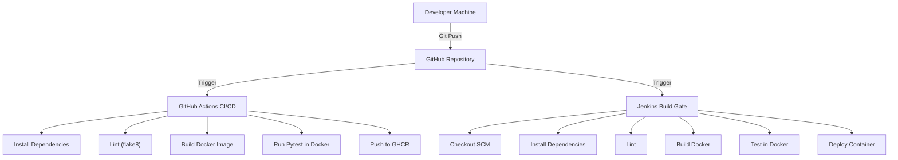

# ACEest Fitness & Gym - DevOps Pipeline

## Architecture



## Project Structure

```text
.
├── src/
│   └── aceest/
│       ├── __init__.py        # Application factory
│       ├── routes.py          # Flask Blueprint & API routes
│       ├── data.py            # Static fitness program data
│       └── db.py              # Database connection manager
├── infrastructure/
│   └── jenkins/               # Jenkins container configuration (IaC)
├── scripts/
│   └── deploy.sh              # Deployment automation
├── tests/                     # Pytest suite
├── .github/workflows/         # GitHub Actions CI/CD
├── docker-compose.yml         # Application deployment orchestration
├── Dockerfile                 # Production Docker image definition
├── Jenkinsfile                # Jenkins Pipeline definition
├── Makefile                   # Unified command runner
├── pyproject.toml             # Python dependencies & build config
└── run.py                     # Local development entry point
```

## Prerequisites

- **Python 3.9+**
- **Docker & Docker Compose**
- **Git**
- **Make**

## 1. Local Development

1. **Install Dependencies:**
   ```bash
   python3 -m venv .venv && source .venv/bin/activate
   make install
   ```
   > **Note:** Use `python3` explicitly. On macOS, `python` may point to Python 2 or be unavailable.

2. **Run Application:**
   ```bash
   python3 run.py
   ```
   The application will be available at `http://localhost:5002`.
   > **macOS Note:** Port `5000` is reserved by AirPlay Receiver. This project uses port `5002` for local development to avoid conflicts.

   **API Endpoints:**
   - `GET /` - API Index
   - `GET /programs` - List fitness programs
   - `GET /clients` - List registered clients
   - `POST /clients` - Register new client
   - `POST /workouts` - Log workout session

3. **Run Tests:**
   ```bash
   make test
   ```

## 2. Docker Deployment

To build and deploy the application locally using Docker:

```bash
make build
make deploy
```
The application will be available at `http://localhost:5001`.

## 3. Jenkins CI/CD (Automated Infrastructure)

We have containerized the entire Jenkins environment with **Infrastructure as Code (IaC)** principles.
**Crucial:** The Jenkins setup wizard is **disabled**, and an admin user is **auto-provisioned**.

1. **Start Jenkins:**
   ```bash
   make infra-up
   ```
   *Wait ~30 seconds for initialization.*

2. **Access Dashboard:**
   Open `http://localhost:8080`.
   - **Username:** `admin`  *(Auto-configured)*
   - **Password:** `admin`  *(Auto-configured)*

3. **Run Pipeline (Automated):**
   - The project uses **Git Hooks** to simulate webhooks locally.
   - Whenever you commit code (`git commit`), the Jenkins pipeline is automatically triggered.
   - You can also manually trigger it by clicking **Build Now** in the Jenkins dashboard.
   - The pipeline will Checkout, Test, Build, and **Deploy** the app to port `5001`.

4. **Stop Jenkins:**
   ```bash
   make infra-down
   ```

## 5. Cleanup & Fresh Start

We provide Make commands to manage the full lifecycle of the environment.

### Stop Services (Preserve Data)
Stops all containers (App + Jenkins) while keeping build history, volumes, and Docker images intact:
```bash
make destroy
```

### Full Reset (Factory Reset)
Completely wipes everything: containers, Docker images built by this project, all volumes, and Jenkins data.
Use this when you want a completely fresh start, as if cloning the repo for the first time.
```bash
make nuke
```
After this, restart the full project with:
```bash
make install        # Install Python deps and set up git hooks
make infra-up       # Build and start Jenkins (wait ~30s)
make deploy         # Build and run the application
```
*Warning: This action is irreversible. All build history and data will be lost.*

## 6. GitHub Actions

The `.github/workflows/main.yml` pipeline ensures code quality on every push to `main`:
- **Linting**: Enforces `flake8` standards.
- **Testing**: Runs `pytest` suite.
- **Build**: Verifies Docker build integrity.
- **Publish**: Simulates push to GitHub Container Registry.
